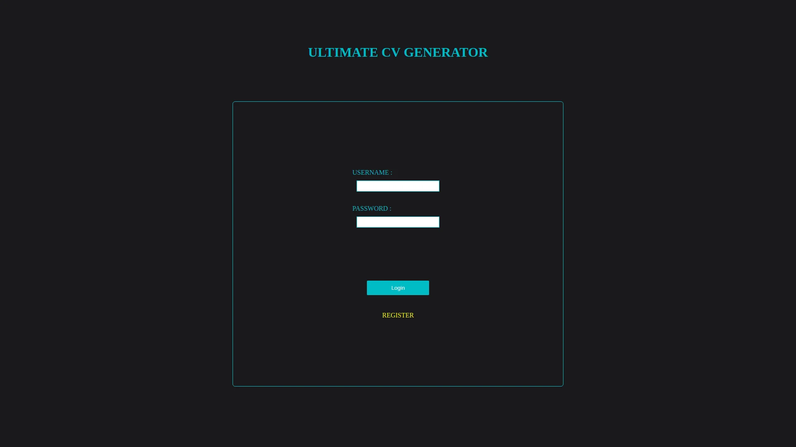
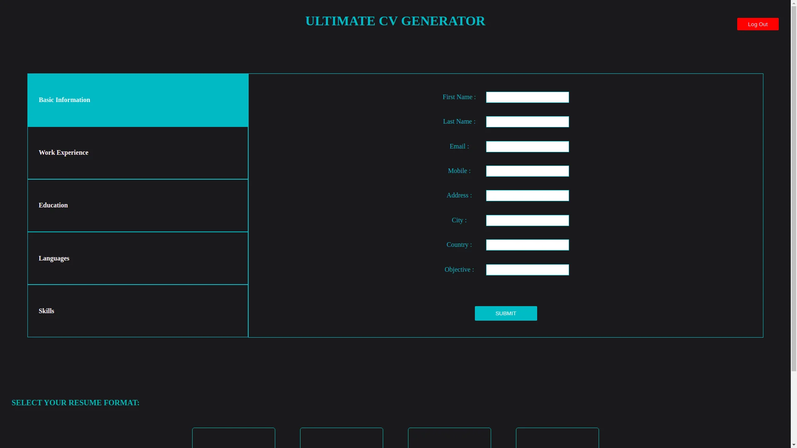
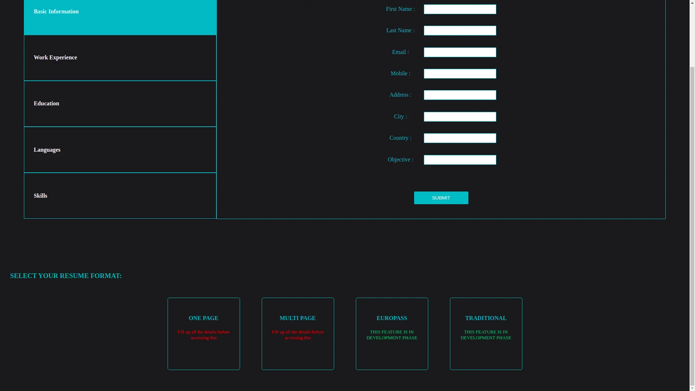
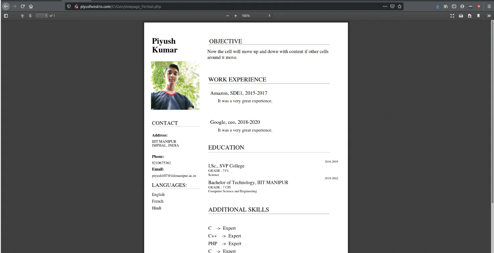

<h1 align="center">
	Ultimate CV Generator
</h1>

	
    	
	

# Overview

<h5 style='font-weight:400'>
This is PHP based web application to generate responsive and dynamic CV. It supports one page format and multi page format CV.
</h5>

# Installation

1. Deploy this project directory in /var/www/html directory, i.e the location which is used by Apache Server to host files .

2. Then setup the database according to the pgsql database file.

3. Navigate to your localhost and then access the project root folder.

# Screenshots

### Authentication

## Star, Fork, Clone & Contribute

Feel free to contribute on this repository. If my work helps you, please give me back with a star. This means a lot to me and keeps me going!

## Contributors

<table>
  <tr>
<td align="center"><a href="https://github.com/antiXlive"> <b>Piyush</b></a> </td>
  </tr>
</table>
